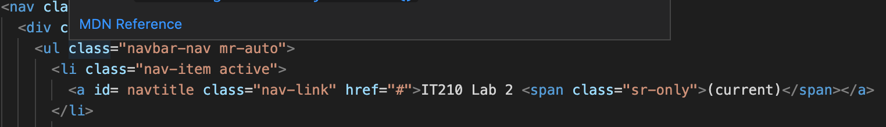
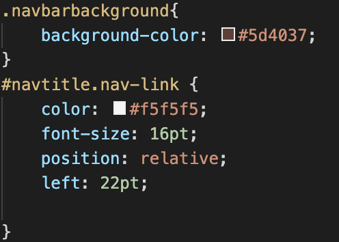
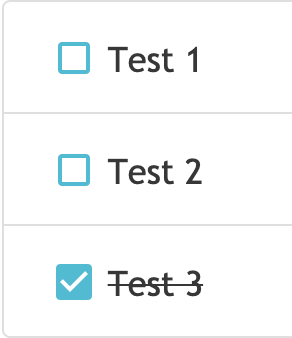
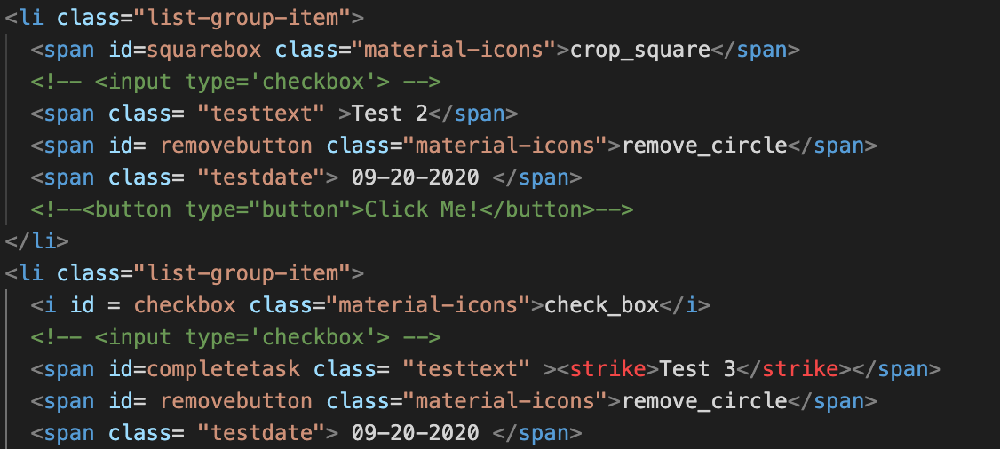
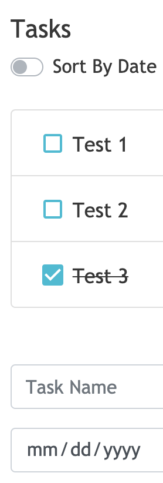
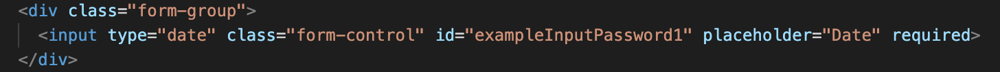
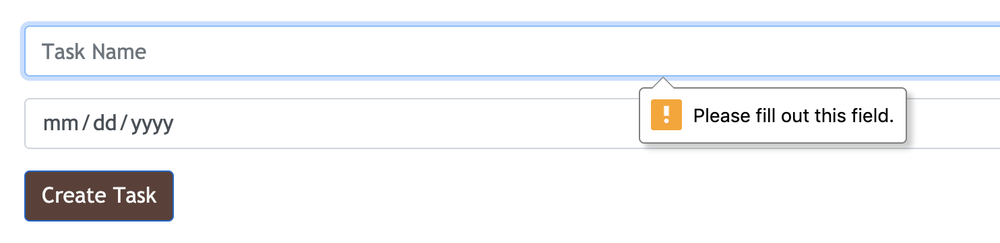

## I.Title
Braden Drake
September 16, 2020
Lab 1
## II.Executive Summary
Through this two part lab, I gained exposure to and experience with both the CSS and HTML programming languages. Using HTML, I created a structure with buttons, switches, and forms to create the appearance of a task list, then used CSS to format and design the page. Additional resources used included *Bootstrap* for different forms and HTML structures and *Material Icons* for the different icons used on the page. 
## III. Design Overview
Without the use of JavaScript, the page is not totally functional. However, many HTML and CSS elements went into the page to give it a more professional look. Topping the page is a "Navbar." This design came from Bootstrap and a corresponding picture of the "Navbar and its code is found in "Appendix A." In order to give it a color other than the default Bootstrap color I needed to create a new id to override the Bootstrap class which can be found in the CSS file also in "Appendix A."

### Apendix A

Corresponding HTML Code

Look of the Navbar

CSS Styling Code

The next section of the page was the task list. This was another preset made on Bootstrap customized with CSS and Material Icons. The two icons included in the task list were the delete button and the checkbox. Because only one of the icons was checked, I needed to create specific classes to distinguish the two and make sure they still lines up with in the task boxes. These different classes and the results are shown in "Appendix B."

### Appendix B
The Check and No Check Icons

Corresponding HTML Code

Aside from the navbar, the entire page had to be vertically aligned. In order to align the other elements I placed them all into a DIV container. The container was done as a class in HTML and encapsulated all elements. This code and resulting look can be found in "Appendix C."

HTML for Container

Vertically Aligned Elements

At the bottom of the page was a form to create new tasks. While the form is not fully functional, it did require that a user attempt to fill out both inputs before validating. In order to create required inputs I used the "required" tag on HTML. The resulting code and form is found in "Appendix D."

HTML Code for Form

Look of the form

## IV. Questions
### Lab 1a
**What is the purpose of using Docker containers?**

A Docker container is useful because it is able to package programs and applications into containers allowing them to be portable to any system. Having all components of the program packaged together makes transporting and running the program much easier.

**Why is it useful to have both a development environment and a live server environment?**

Especially with larger projects, having a development and a live server environment is crucial for the success of the program. The development environment is needed for debugging and testing. If these tests are run directly on the live server, any bug could crash the site for other users. By separating work into the two environments, the programmer can run and test code in the development environment and send finished, bug-free code to the live server. 

**What is the purpose of using a code versioning tool (i.e. git)?**

A code versioning tool is useful for tracking changes during software development. Especially when collaborating between many different programmers, a code versioning tool can take changes from different programmers and consolidate them into a single program. 
### Lab 1b
**What is the relationship between CSS and Bootstrap?**

CSS and Bootstarp are both front-end development frameworks that aid in the design of websites and programs. The main difference bewteen CSS and Bootstrap is that Bootstrap utilizes a combination of CSS and JavaScript to provide additional design and functionality. 

**Describe how web browsers choose which CSS to use for an HTML element when the CSS rules contradict each other?**

Web browsers follow the "CSS specificity value." A browser will choose the selector which occurs closer to the bottom of the list of selectors.  

**List 2 reasons why using Bootstrap can be useful.**

Bootstrap provides well designed components without needing an extensive knowledge of HTML and CSS.Bootstrap is also helpful because it is built with a responsive grid system.
 
**Why would you disable directory access for your server?**

Disabling directory access for your server would be helpful when the directory contains other important files. A disabled directory restricts directory access to other visitors on the site. 

## V.Lessons Learned 
### Vertical Alignment of Elements
Within HTML and CSS there are different ways to align text. Setting margins and page width does always not solve the problem of aligning elements. This is because there are different element sizes and default dimensions. To solve this issue create a DIV container. All the elements within the container immediately align with much less work than margins and page width. 

### Linked CSS Stylesheet
There are times when a CSS stylesheet will not correctly link to the HTML file. This occurs when the stylesheet is not linked with the correct folder. For example, the stylesheet is located in the CSS folder but the HTML only references the file name. To solve this issue, either keep the stylesheet in the same folder as the HTML or reference the folder where the stylesheet is found.

### IDs and Classes to Name Elements
While using *Material Icons* I found that all of the icons had the same class even being different designs. When I used that class in the CSS stylesheet it affected all icons instead of the specific icons. In order to solve this issue use both classes and IDs to distinguish between elements of the same class or type. 

## VI. Conclusions
-Pass code to a live server

-Utilize Bootstrap to customize html

-Create and execute a color scheme for a web document

-Structure and design a static web page

-Coordinate CSS and HTML to create a web page

-Communicate and pass programs between a code versioner, web development technology, and a live server

## Resources

1. https://opensource.com/resources/what-docker
   (Helpful for understanding Docker)
2. https://linuxtogether.org/why-should-we-have-separate-development-testing-and-production-environments/
    (Difference between environments)
3. https://www.thesitewizard.com/apache/prevent-directory-listing-htaccess.shtml
    (Understanding the need for removal of directory access)
4. https://phoenixnap.com/kb/apache-access-log
    (View Apache Error Log)
