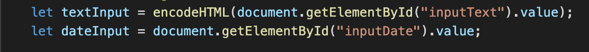

## I.Title
Braden Drake
September 30, 2020
Lab 2
## II.Executive Summary
Through this two part lab, I gained exposure to and experience with the JavaScript programming language. Using JavaScript, I added "muscles" to the task list that I created in lab one. I created various functions dealing with arrays that allow users to save items to local storage and make changes to the elements within those items. I also used Higher-Order functions to sort tasks and hide completed tasks. In addition to Javascript, I used some special functions to encode date to prevent against Cross Site Scripting and mores specifically, DOM-based attacks .
## III. Design Overview
There are four main components to this two part lab. First the creation and manipulation of tasks. Second the ability to sort the tast lisk. Third the ability to hide completed tasks on the list. And four the ability to prevent against DOM based XSS attacks. In the UML diagram found in "Appendix A," there is a description of how exactly the program runs and more specifically how items are called, saved, and read from local storage. The process described in the UML is as follows: a user enters the webpage and the page reads the localstorage. If there is anything found in local storage the elements will be parsed to the DOM for the user to see. Otherwise the user will have an empty task list to add tasks to. 

### Appendix A

Lab 2a UML

The UML diagram found in lab 2b focuses on the functionality of the two switch functions, "sort by" and "hide completed." Both of these switches follow similar paths. When one of these functions is called, a copy of the original tasks array is created and manipulated. The tasks copy is either sorted by the date element in the task object or deletes the tasks with the done elements marked as true. Then the readstorage function is called to parse the tasks Copy array to the DOM instead of the original array. This process is shown in the UML in "Appendix B."

### Appendix B
Lab 2b UML

The main concept of this lab is to show how to utilize local storage to create and manipulate tasks on a task list. After a task was created, the user had the ability to delete that task or mark it as complete. The mark as complete function changed the "done" element within the task object to true. This caused the task text to appear with strikethrough and checked the checkbox. The JavaScript code used to create this function along with a visual of the result on the DOM is shown below in "Appendix C."

### Appendix C
Update function results

Code for update function

The second half of the lab was understanding and creating functional switches. As was explained in the second UML. These switches created array copies that were manipulated to sort the task list the right way, either by date or hiding completed tasks. These functions utilized if/else statements to call either the readStorage or the readStorageCopy to present the correct array on the DOM. A view of the functionality of these switches along with their corresponding JavaScript functions can be found in "Appendix D."

### Appendix D
Date Sort Results

Date Sort function

Hide Completed function

Hide Completed Results

The last main element from these labs was protection against XSS DOM-based attacks. These attacks occur within the input boxes of websites where people can input malicious JavaScript to manipulate the page. In order to prevent against this type of attack we had to encode the data. This function would take the power out of using different tags but still present them on the screen. An example of this is shown in "Appendix E" with the corresponding code. 

### Appendix E
XSS Encode JavaScript

XSS Encode Results

## IV. Questions
### Lab 2a
**What are two differences and similarities between JavaScript and C++?**

One similarity betweeen C++ and JavaScript is the syntax. While not exactly the same, many aspects of the syntax like adding comments to the code and assigning relationships between variables are identical. Another similar aspect is the creation and use of loops. The construction of loops is identical for C++ and JavaScript. Using parameters, opening and closing the loop with "{" symbol, and even their functionality. One difference between JavaScript and C++ is their language. C++ is a programming language where as JavaScript is a scripting language. Another difference is that JavaScript code is made generally for web technologies while C++ is build for a much larger scope ranging from programs to operating systems.

**What is the difference between JSON and JavaScript objects?**

JavaScript objects are mainly used to create objects. JSON is used not to create objects but to transfer data between computer systems. JSON is basically a string version of the JavaScript object. 

**If you open your web page in two different browsers, will changes on one appear on the other? Why or why not?**

If you make changes on the web page in two different browsers the changes on one will not appear on the other. This is because local storage is "local" so changes in a browser on remain on that browser. 

**How long did you spend on this lab?**
12-14 hours

### Lab 2b
**How did you protect your site against Cross-Site Scripting? Which type of Cross-Site Scripting did you protect against?**

I protected my site against Cross-Site scripting by using an encode function that incorporated a replace function that took the power out of HTML or JavaScript tags. I put this function in the create task function to ensure that the task name input would not insert malicious JavaScript into my site. This style of XSS attack is known as DOM-based XSS. 

**What is a Higher-Order Function?**

A higher order function is a function that takes a function as an argument or returns a function as an argument. Basically a function that runs on other functions. 

**What are the differences between the oninput, onkeyup, and onchange events? When do they trigger, when might you use one over the others?**

These three events are all event listeners that trigger action on a page. OnInput triggers whenever the input changes. This would be useful when you want to save user input even when they have not uploaded it or pushed a button to send it somewhere. Onkeyup is when a user releases a key on the keyboard. This could be useful when designing a game. Perhaps controls should be activated when pressing or releasing keys. And lastly, onchange occurs whenever a value of an element has changed. This would be useful when tracking changes to inputs or large bodies of text. 

## V.Lessons Learned 
### How to Access Elements in an Array of Objects
Similar to C++, JavaScript can create an array of objects with a number of different characteristics. In order to sort by date, I needed to access the date element of each array object. To accomplish this I used the sort() function and used the parameters a.date > b.date to compare the different dates between objects. 

### How to get elements from local storage to appear on the DOM
Many times with my functions I was able to get inputs and changes to the array saved on local storage without it appearing on the DOM. TO solve this problem I created a readTasks function that would convert the data from local storage to be compatible to show up on the DOM. Wihtout that function there would be no visual change. 

### Value of Console Log
Console.log became a life saver for me to check and see if things were changing in local storage. There were many times where there were no changes made to the DOM but when reviewing them with console.log I could see changes being made to local storage. I learned that you can even put a specific array in console.log and it will display the contents of the array after changes made. To do so simply place the name of the array into the parenthesis of console.log. 

## VI. Conclusions
-Utilize high-order functions

-Transfer items from local storage to the DOM

-Utilize JavaScript to create a functional website

-Use Javascript functions to prevent against DOM-based XSS

-Coordinate event listeners to give functionality to the HTML

## Resources

1. https://stackoverflow.com/questions/2794137/sanitizing-user-input-before-adding-it-to-the-dom-in-javascript
   (Helpful for DOM based attack prevention)
2. https://stackabuse.com/clone-arrays-in-javascript/
    (How to copy an array)
3. https://stackoverflow.com/questions/41629165/global-variables-in-js-vs-local-storage-vs-values-in-dom-which-one-will-be-more#:~:text=Global%20variables%20are%20in%20memory,you%20have%20additional%20network%20latency.
    (DOM vs local storage)

