## I.Title
Braden Drake
October 15, 2020
Lab 3

## II.Executive Summary
Through this two-part lab, I have gained exposure to and experience with both the PHP and SQL programming languages. I recreated the functionality of my task list created in lab 2 with the use of PHP instead of JavaScript. In addition I created two new pages where users can register and login to save their personal task lists. This change involved the use of a database in PHPMyAdmin instead of local storage to store the different tasks and users. 

## III. Design Overview
Within this lab there are nine PHP files corresponding to different views and actions of the login, register, and task list page. 

Part one of this lab dealt with the functionality of the login and register pages. The process of these two pages is found in the UML diagram found under "Figure 1." The process described in the UML is as follows: a user opens the site and the browser displays the login page. The user can either login or create a new account. The user will enter their information, the server will check for matching passwords and username data in the database then create session variables for the user and allow them access to their task list. 

#### Figure 1
Lab 3a UML
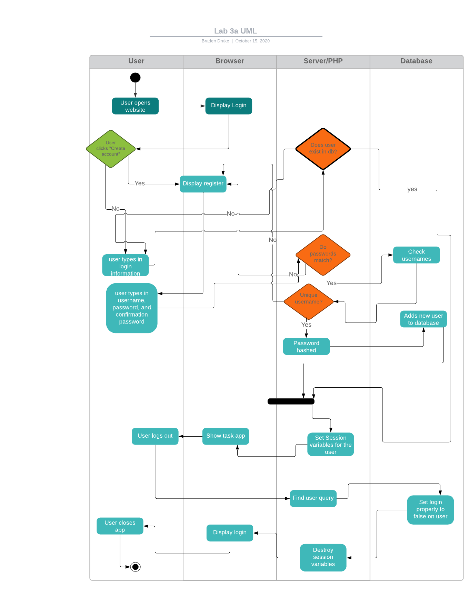

The UML diagram found in lab 3b focuses on the functionality of the task list. The process is shown in "Figure 2." A brief recap of this UML is as follows: after a user is logged in or registered, the server will use the read function to check the database for any tasks with the same user_id as the user logged in. The user will now have access to create, update, or delete tasks on the list. Each of these functions grabs the users id to create, update, or delete the correct task in the database. The task list page reloads and allows the user to make another change to the page.  

#### Figure 2
Lab 3b UML
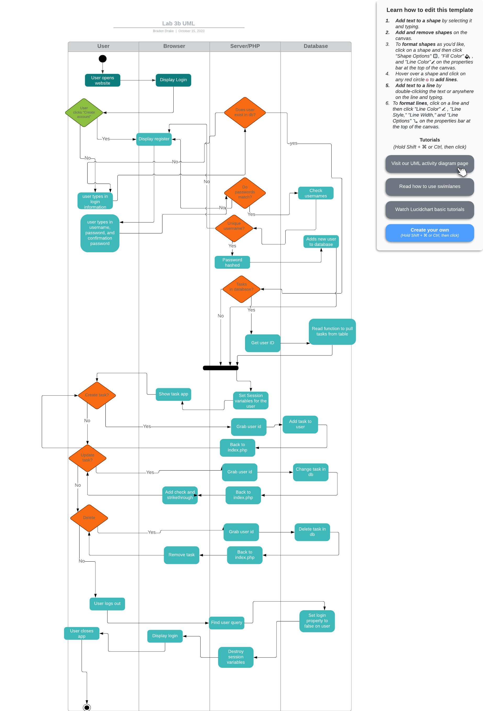

### Login_action
The login action takes the user inputed username and password and verifies them on the data base with a series of prepared "SELECT" SQL statements. The program checks to make sure the username found in the database has a password that matches the password and that the hashed password from the database matches the password entered by the user. After the user has been verified and the password is confirmed, another prepared SQL statement "UPDATES" the "logged_in" variable for the user. The session variables are set for the user. The user is then directed to their task list. "Figure 3" shows the look of the login page along with the prepared SQL statements involved with pulling the username and password from the database. 

#### Figure 3
Login Page
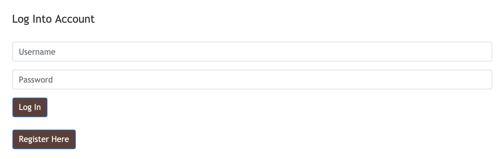

Login_action file
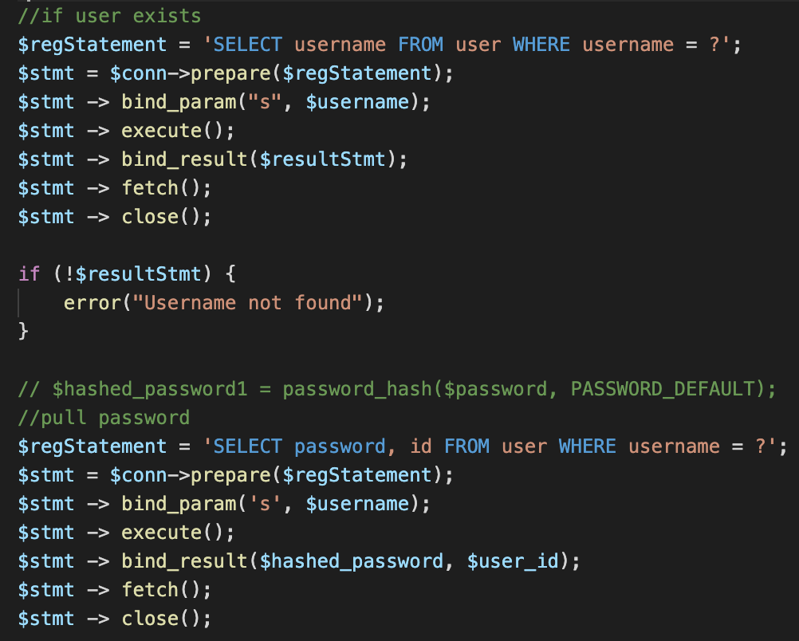

### Register_action
The register action also makes use of prepared SQL statements to insert a new user into the database. Before insterting, the program checks to make sure the username isn't taken by checking for the username in the database. The program also checks to make sure that the password and confirmation password match. Once both of those checks are passed, an "INSERT INTO" statement is run to enter the new user and password into the database. The session variables for the user are set and the user is redirected to their task list. "Figure 4" shows the registration page view and the function used to insert a user into the data base. 

#### Figure 4
Register Page
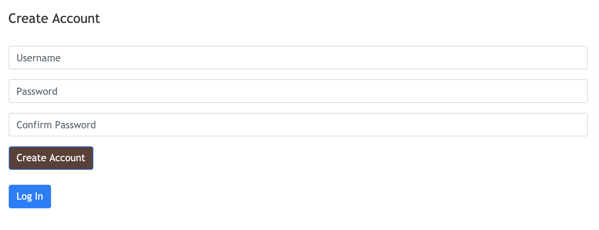

Register_action file
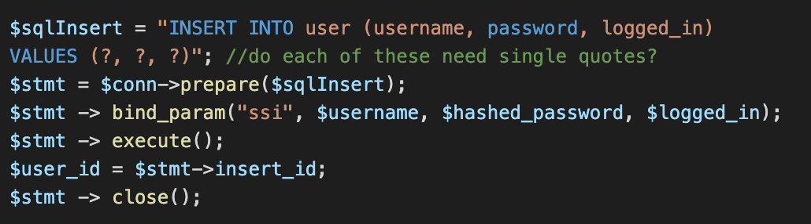

### Logout_action
The logout action does the opposite of the login function. There is a form on the logout button that when clicked, uses a prepared "UPDATE" statement to change the "logged_in" variable. The program then unsets the session variables and destroys the session before returning the user back to the login page. "Figure 5" shows the a view of the button and the code used to unset the session variables and destroy the session.

#### Figure 5
Logout Button

Logout_action file
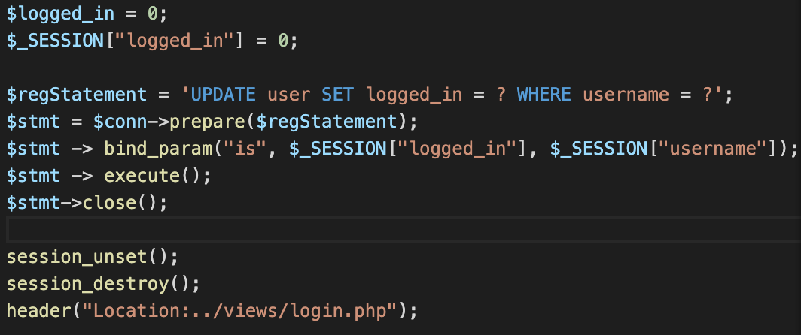

### Create_action
The create action involves a similar functionality as the register action but with a task. When the user clicks the "create task" button, a new task along with its variables are inserted into the task table in the database. The task takes the "user_id" of the user logged in to associate the created task with the correct user. After the task is added to the database the user is redirected back to their task list to add another task. 

#### Figure 6
Create Action Code
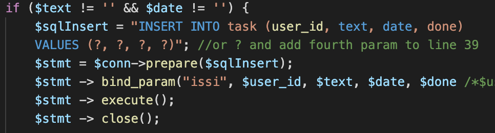

Task page with a task
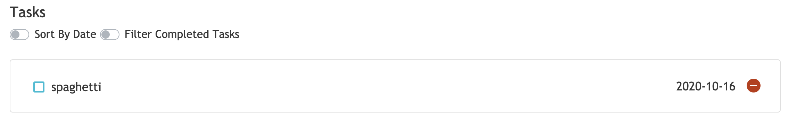

### Read_action
The read action is done within the "index.php" file. This action connects to the MySQL database and runs a "for" loop to do a "SELECT" statement and grab any tasks associated with the specific "user_id". This action also includes an echo statement that outputs the task with the correct CSS formatting. "Figure 7" shows the code to run the SQL statement and corresponding "for" loop.

#### Figure 7
Read Action Code
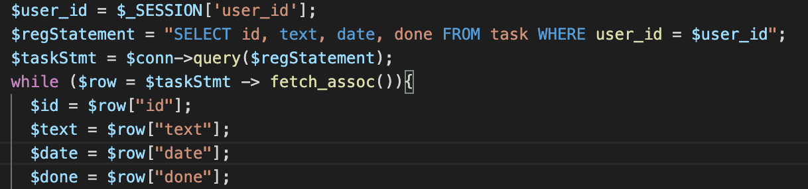

### Update_action
The update action has a very similar functionality as the login and logout actions. When a user clicks the check box next to the task, the invisible button wrapped around the icon triggers and a prepared SQL "UPDATE" statement is triggered that toggles the "done" variable in the task from not done to done or vise versa if the task is already checked. In "index.php" the icon displayed and the text changes depending on whether or not the "done" variable is marked as true or false as is shown in "Figure 8"

#### Figure 8
Update Action Code
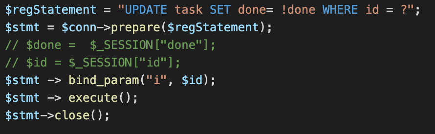

Update Action View

### Delete_action
The delete icon is also wrapped in a button and when clicked, the program runs a prepared SQL "DELETE" statement that not only removes the task from the browser but also the database. The corresponding "DELETE" statement is shown in "Figure 9."

#### Figure 9
Delete Action Code
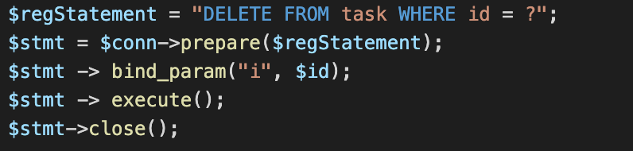

## IV. Questions
### Lab 3a
**Describe how cookies are used to keep track of the state. (Where are they stored? How does the server distinguish one user from another? What sets the cookie?)**
Everytime the user enters a website, the cookies store different variables on the users device. The cookies have a unique ID for each user. So when a user enters, the cookies with the user's ID are pulled from the "cookie jar" and are used to alter the webpage. 

### Lab 3b
**Describe how prepared statements help protect against SQL injection, but not XSS.**
When an SQL statement is created with user input, the user input is part of the SQL statement. Preparing statements forces the database to handle user input as content and not part of the SQL query. However, this content is not encoded when prepared, this content can still be read as JavaScript and leave the database vulnerable to XSS.

**Describe at least two key differences between the PHP version of the task list and the JavaScript one you completed in labs 2A and 2B.**
The first difference is that each of the action icons (like the check box and delete) are wrapped in buttons. This is because PHP does not use event listeners but rather "form" tags to create actions. These form tags only work with the "submit" type which icons cannot execute. JavaScript can use event listeners on the icons to eliminate the need for buttons over the icons. 

Another key difference with the task list is where data is stored. On the JavaScript version, data was stored in local storage. This is only accessible in the user's browser. However, the PHP version utilized a database. Once the data base is set up, the PHP task list can be accessed from any browser. 

**If we created a new table login_logout in the database to keep track of login and logout times of our various users, what would that table's schema look like? Describe necessary fields, which fields would need to be primary or unique, and what data type you would use for each.**
For creating a new table called login_logout in the database. The table would need a few different fields. The primary field would be the user_id. This would be the main tracker of how many times each user has loggin in and out. This data type would be an integer. The second field would be a bool type with the current status of the user. The third field would be the time spent logged in. This would count in minutes and be recorded as an integer data type. There would also need to be an id for each of the login/logout sessions. This would autoincrement but keep the user_id and the data type would be an integer. The two last fields would be a date type that would record the day the user logged in and the day the user logged out. 

## V.Lessons Learned 
### How to turn buttons invisible
When utilizing the action function in HTML, it is necessary to utlize buttons. However, not all actions want to have buttons. To solve this issue one can wrap whatever icon or text box in a button and change the type to "submit." Most of the time though this leaves your icon inside of an ugly button. To solve this problem one needs to add two lines to their CSS corresponding to the button: background:transparent and border:none. This will ensure that the button will not appear over your icon but still have the functionality of the button. 

### How to use "fetch assoc" to get each part of an array
When trying to get a program to read and print each part of an array, it is a lot of work doing separate SQL statements for each array index. Instead, use a "for" loop combined with the "fetch_assoc" function to run through each part of the array to be read and printed. 

### Value of echo
Many times throughout our use of databases and setting sessions, it is hard to know whether or not the right session variables are being saved. An easy way to check if the variables are being saved correctly is to "echo" out the variables you want to check after the action is performed. That way you can see on your page whether or not the actions are performing correctly.

## VI. Conclusions
-Utilize prepared SQL statements

-Transfer items to and from a database

-Utilize PHP to mimick the functionality of JavaScript

-Link a single CSS sheet to multiple pages

-Create loops with PHP functions to print arrays

## Resources

1. https://stackoverflow.com/questions/1582161/how-does-a-preparedstatement-avoid-or-prevent-sql-injection
   (Helpful for understanding prepared statements)
2. https://www.w3schools.com/php/func_mysqli_fetch_assoc.asp
    (How to use fetch_assoc)
3. https://www.tutorialspoint.com/What-is-the-difference-between-session-and-cookies#:~:text=Cookies%20are%20only%20stored%20on,as%20well%20as%20a%20server.&text=A%20session%20creates%20a%20file,the%20site%20during%20that%20visit.
    (Understanding session variables vs. cookies)

