## I.Title
Braden Drake
November 18, 2020
Lab 5

## II.Executive Summary
Through this unique one part lab, I was able to gain exposure to and experience with server hardening and regular expressions. In order to gain experience with Regex I had to create two different Regex expressions to match with phone numbers and emails without matching improperly formatted selections. After that I used the command line and Fail2Ban to set up certain triggers that ban users for suspicious behavior. Lastly I created a Python document that sends me an email each time the jail is triggered and a user is banned. 

## III. Design Overview
### Explore Regex
#### Emails
For the first section, I created a regular expression to match with the list of emails shown below. I had to ensure that the first character of the email was either a letter or number. From there, I had to allow special characters like "-", ".", and "_" until the search reached the "@" sign. After the "@", another letter or number had to follow and then only letters, numbers and the "-" were allowed. After that there was a specific number of endings that were allowed like .com and .gov. 

`/^pattern$/gm`
Email Pattern
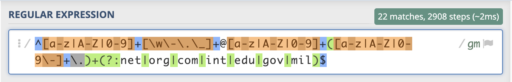
Email Matches
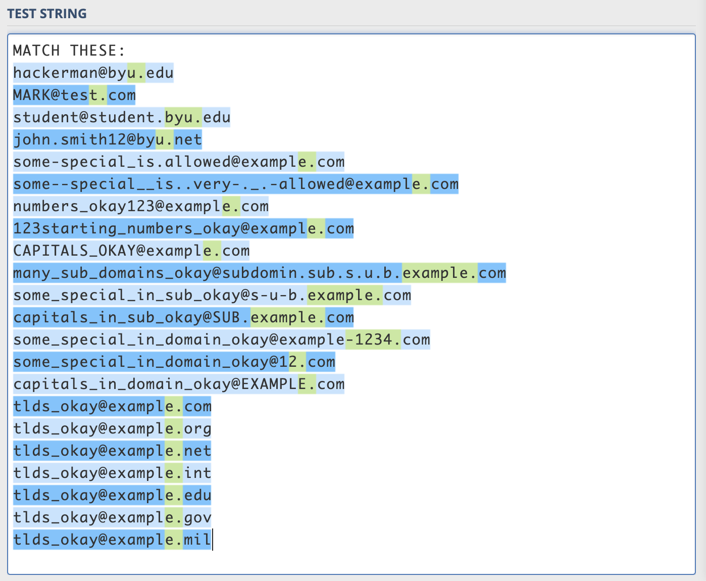

#### Phone Numbers
The second section was similar to the first but I needed to match with the following phone numbers. In order to achieve this match I had to create a two pronged expression connected with an OR statement. One side of the OR statement had the phone number structure with hyphens included and the other side did not. This way both formatted and unformatted numbers were picked up in the search. I also made the first 3 digits of each side optional to account for the 7 digit numbers without the area code. 
`/^pattern$/gm`
Phone Pattern
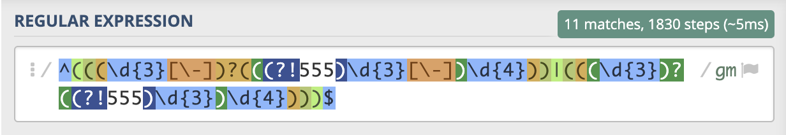
Phone Matches
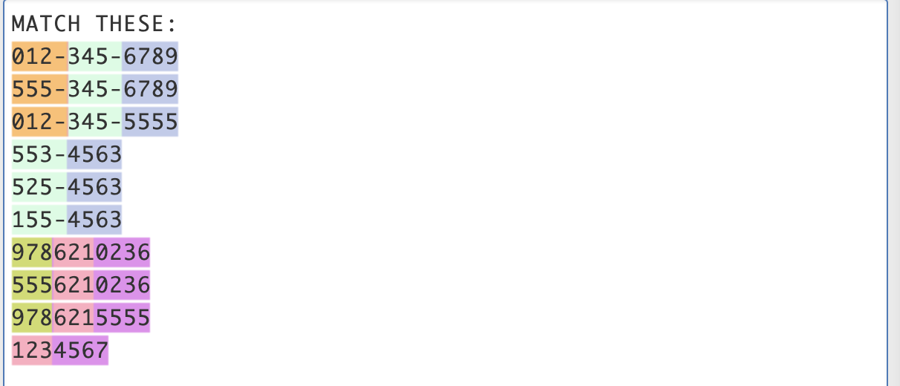

### Fail2Ban Log
The first jail created was "test-jail." This jail banned users for trying to access the "hacker" endpoint on the Apache site. The successful ban log showing the banned IP address is shown below. 

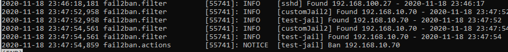

### Custom Jails (20 points)

#### `jail.local/filter.d`
After creating "test-jail", I created two additional jails. These jails were defined in "filter.d" and the jails' settings were formatted in "jail.local" The first jail, "customJail1", picks up users who are trying to access the "admin" page of the mock website. I used a regular expression querying for the word "admin." If the access log picks up the word "admin" three times in three minutes the user will be banned for 90 seconds. This would be useful for an administrator because it would alert them of people trying to access secure information. The admin page of a website normally includes settings and other important site information. So if a person is trying to get into that page the administrator should be aware to take action.

Custom Jail 1 (filter.d)
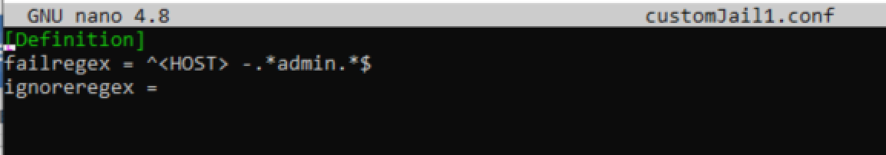
Custom Jail 1 (jail.local)
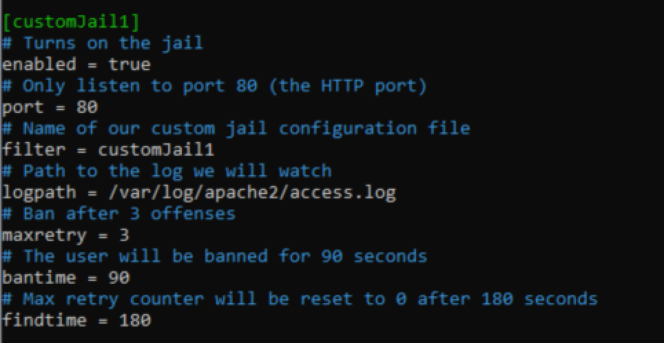

The second jail created was "customJail2." This jail uses regular expressions to query for "404" errors returned when trying to access the website. If five 404 errors are returned within 30 seconds the user will be banned for 90 seconds. This jail would be important for an administrator because it would alert them about users trying to brute force their way into hidden pages. If the banning occurs it means the user is intentionally trying to find a page that does not exist and not merely commiting an error. 

Custom Jail 2 (filter.d)
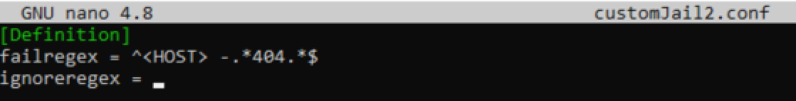
Custom Jail 2 (jail.local)
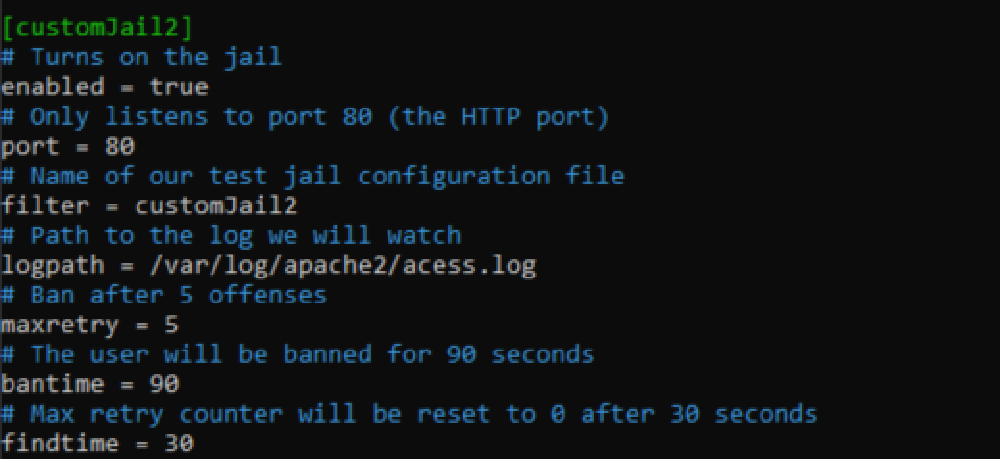

### `fail2ban-regex`
As aforementioned, the jail definitions use regular expressions t query for certain keywords in the access logs. The following pictures show the results of the functioning Regex queries and corresponding jail bail list for "customJail1" and "customJail2."
Custom Jail 1 (fail2ban-regex)
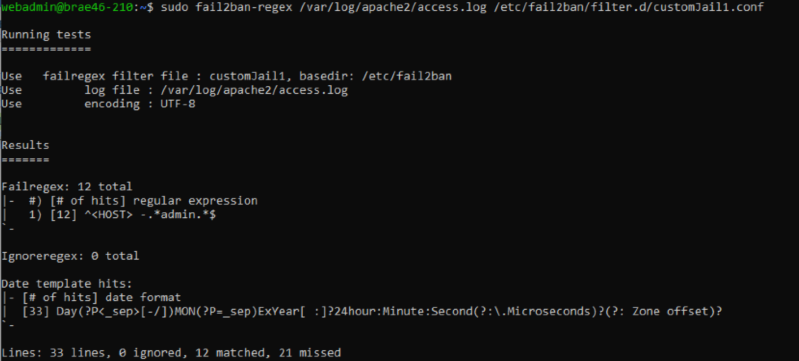
Custom Jail 2 (fail2ban-regex)
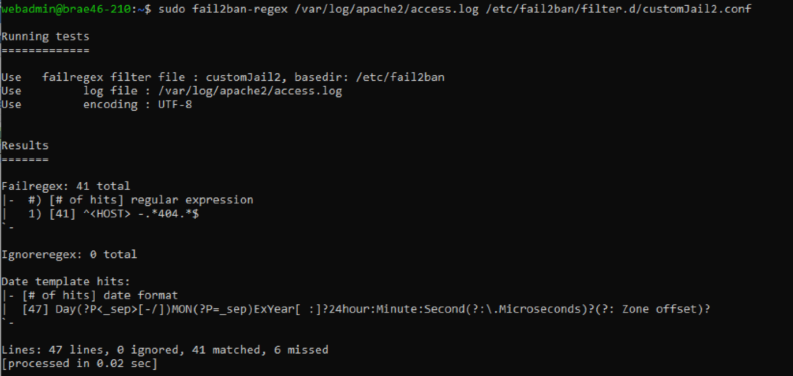

Custom Jail 1&2 ban list
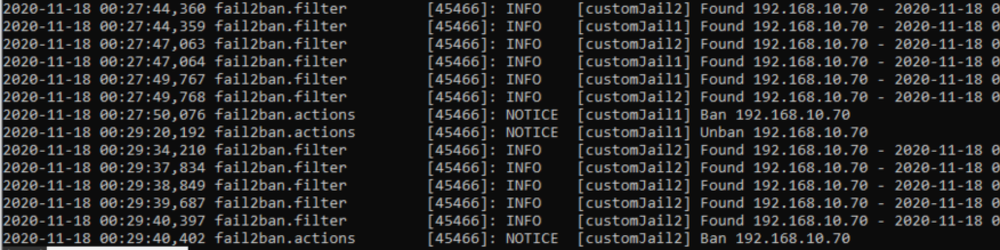

### Python script (40 points)
This Python script is a "ban-action." When a user is banned an email is sent to my inbox alerting me that there has been a banning and that I need to check the log to see what the problem is. This would be useful to an administrator because it would alert them of potential hacks and give them time during the ban to find out what triggered the ban action. 

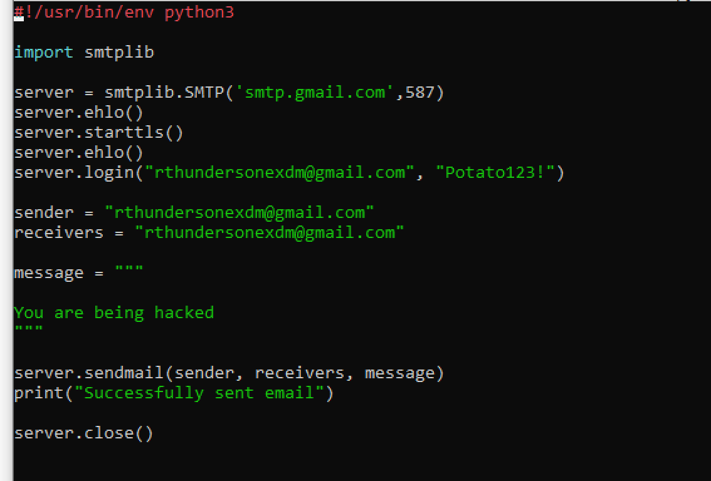

 
## IV. Questions
### Lab 5b
**N/A**

## V.Lessons Learned 
### How to copy and paste in the Command Prompt
Often when working on the Command Prompt a user is repeating the same lines of code or having to input long strings of information. It can take up a lot of time trying to type and retype that information and traditional copying and pasting does not work. However, after copying the desire code, by simply right-clicking in the command line, the code will be pasted onto the Command Prompt. 

### Using the terminal to debug Python

When trying to create my email program in the Python language there are usually errors to debug. In order to more effectively identify the errors to debug, the user can enter "python -the line of python code-." Entering this into the terminal will allow the terminal to run the code to make sure it performs its function without error. This is a great way to find the exact problems in the Python scripts. 

### Creating language files on the Command Prompt

When creating a file of a different language like Python that will be used on the server, sometimes the first instinct is to create it on Visual Studio or another platform for programming and linking it to your Command Prompt action. However, to decrease complexity and ensure the program is running on the right server, the Python file can be created directly on the Command Prompt and edited with Nano. Simply use the file creation command "touch" and manipulate it similar to any other file used with Nano on the Command Prompt.

## VI. Conclusions
-Hardened a server

-Used the Command Prompt to create and test files

-Used Fail2Ban to create tests and jails to ban servers

-Used regex to find match certain strings

-Linked Python from the command line to an email

## Resources

1. https://www.tutorialspoint.com/python/python_sending_email.htm
   (How to send an email with python)
2. https://www.regular-expressions.info/email.html
    (Helpful for all things Regex)